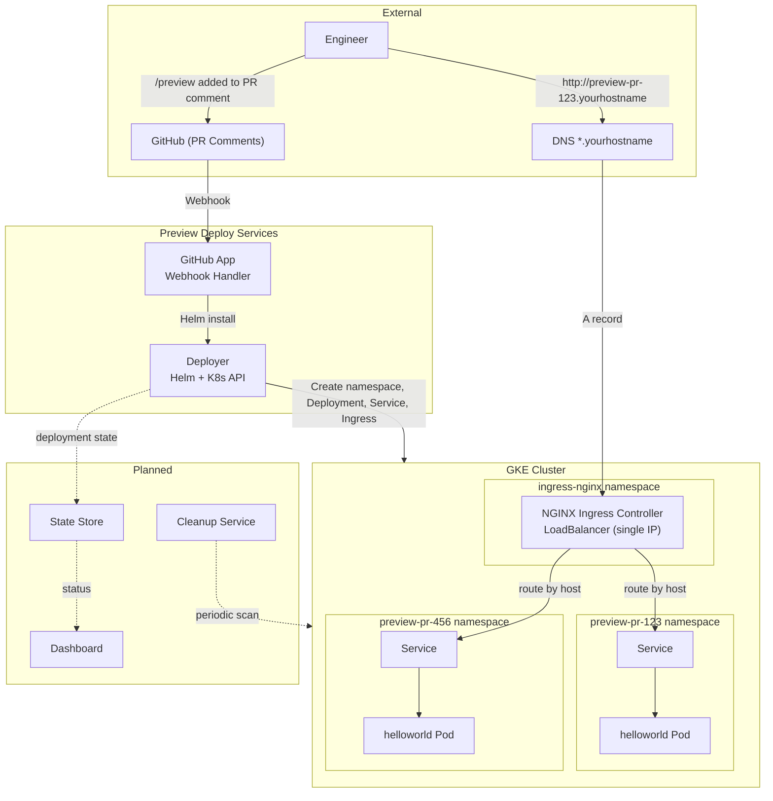
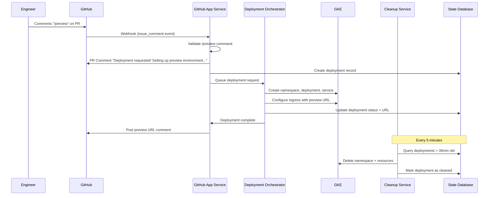

# Github PR Deploy Preview

This repository explores the design and early implementation of a **preview deploy service** that allows engineers to deploy to an ephemeral preview environment directly from a GitHub pull request.

The primary goal is to improve developer confidence and reduce production risk by making changes visible and testable before merge.

> ⚠️ This project is intentionally a **work in progress** and is focused on architecture, tradeoffs, and developer experience rather than full production hardening.

---

## Problem Statement

Before deploying to production, engineers benefit from seeing their changes live in an isolated environment. The desired developer experience is simple:

1. An engineer comments `/preview` on a pull request (chose this over `/deploy` to be explicit that this isn't going to production)
2. Changes are deployed to a preview environment automatically
3. A preview URL is posted back to the PR
4. The environment is cleaned up after a fixed TTL

---

## Requirements

1. **Developer Experience**  
   - Engineers trigger preview deployments via a `/preview` comment on a GitHub PR.
   - preview url return within seconds, not minutes.
   - if it takes minutes to spin up, communicate back to the engineer on status

2. **Automatic Cleanup**  
   Preview environments must clean up after themselves to avoid unnecessary infrastructure cost.
   Preview environments available for 4 hours or when PR is closed

3. **Scalability**  
   The system should handle bursts of activity (e.g., ~50 concurrent PR preview requests).

4. **Failure & Orphan Handling**  
   Partial or failed deployments may leave orphaned resources; these must be detected and cleaned up safely.
   
5. **Security**
   Prevent access to folks external to the company.  

---

## Architecture  

Design decisions and tradeoffs are documented in `/docs/decisions`.

### Core Components

| Service                                              | Description 
| ---------------------------------------------------- | ------------- |
| helloworld |  A simple containerized Python application used as the preview workload. |
| githubapp | A GitHub App that listens to webhook events and responds to `/preview` commands on pull requests. |
| deployer | A Deployment Orchestrator - Responsible for provisioning preview environments in GKE and generating preview URLs. |
| cleanup | Periodically scans for expired or orphaned preview environments and removes them. |
| statestore | Tracks preview deployments, ownership, timestamps, and lifecycle state. |
| dashboard | Displays the status of previews |

---

## High-Level Flow 

--- 
## Screenshots

Will eventually add screenshots or video here.

---
## Quickstart

1. [Setup](/src/setupgke/README.md) preview Google Cloud Kubernetes Cluster 

---

## Status

### Done:
- Architecture and core flow defined
- Python helloworld app created for the simulated app to deploy
- GitHub App webhook handling to process /preview and post a comment in the PR that "Deployment requested! Setting up preview environment..."
- Refactor and modularize githubapp 
- Setup initial GKE preview environment and manually perform deploy steps of helloworld 
    - Build Docker Image(s)
    - Publish Docker Image to container registry
    - Build helm chart
    - Deploy helm chart
    - Get preview URL

### Wip:

manual steps work, focus on deployer, milestones below
m1: chose statestore, schema and claim logic
m2: cloud tasks queue setup 
m3: update github-app to use enqueue
m4: deploye worker task handler and peforms helm install
m5: idempotency and error handling
m6: deployment and scaling
m7: documentation 

### Next: 

7. dashboard of preview status
8. create clean-up service
9. create scaffolding for services, that incorporate 12factor app factors and observability.
9. expand complexity of app beyond helloworld
9. support for launching dependant services
10. population of initial data into the application

