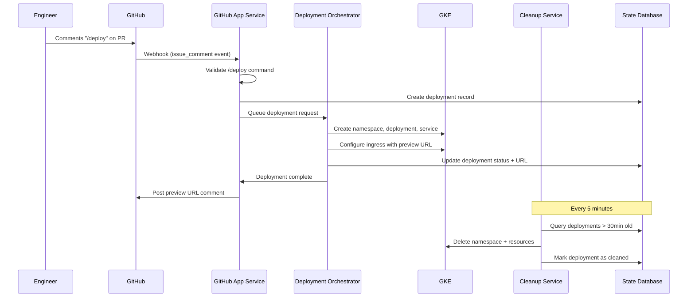

# Github PR Deploy Preview

# Requirements 

1. Create a developer experience that involves an engineering executing a /preview command in github that kicks off the deploy to a preview environment and then provides a preview-url to the engineer.

2. After the preview is comlpeted, clean-up after one-self

3. Additional scenerios to consider, 50 PR /preview requests at a time.  

4. Partial prview deploys, where a container might orphaned, how do you handle that to prevent unnecessary costs. 

# Architecture Overview 

See /docs/descisions for design descisions

1. Hello World App - Simple Python static site container
2. Preview GitHub App Service  - Webhook server that listens for /preview command
3. Deployment Orchestrator - Manages GKE deployments and generates preview URLs
4. Cleanup Service - Handles cleanup and orphan detection

## Flow 

