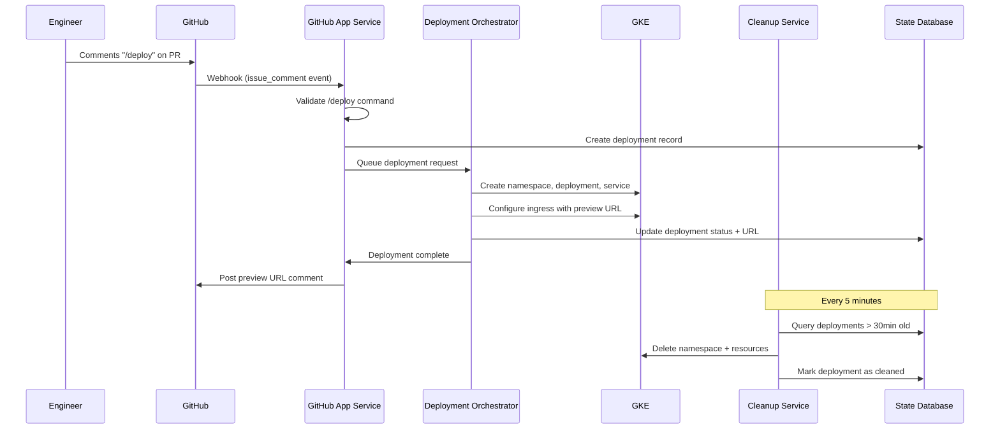

# Github PR Deploy Preview

This repository explores the design and early implementation of a **preview deploy service** that allows engineers to spin up ephemeral preview environments directly from a GitHub pull request.

The primary goal is to improve developer confidence and reduce production risk by making changes visible and testable before merge.

> ⚠️ This project is intentionally a **work in progress** and is focused on architecture, tradeoffs, and developer experience rather than full production hardening.

---

## Problem Statement

Before deploying to production, engineers benefit from seeing their changes live in an isolated environment. The desired developer experience is simple:

1. An engineer comments `/preview` on a pull request (chose this over `/deploy` to be explicit that this isn't going to production)
2. A preview environment is deployed automatically
3. A preview URL is posted back to the PR
4. The environment is cleaned up after a fixed TTL

---

## Requirements

1. **Developer Experience**  
   Engineers trigger preview deployments via a `/preview` comment on a GitHub PR.

2. **Automatic Cleanup**  
   Preview environments must clean up after themselves to avoid unnecessary infrastructure cost.

3. **Scalability**  
   The system should handle bursts of activity (e.g., ~50 concurrent PR preview requests).

4. **Failure & Orphan Handling**  
   Partial or failed deployments may leave orphaned resources; these must be detected and cleaned up safely.

---

## Architecture Overview 

Design decisions and tradeoffs are documented in `/docs/decisions`.

### Core Components

1. Hello World App - A simple containerized Python application used as the preview workload.
2. Preview GitHub App Service  - A GitHub App that listens to webhook events and responds to `/preview` commands on pull requests.
3. Deployment Orchestrator - Responsible for provisioning preview environments in GKE and generating preview URLs.
4. Cleanup Service - HPeriodically scans for expired or orphaned preview environments and removes them.
5. State Store -  Tracks preview deployments, ownership, timestamps, and lifecycle state.

---

## High-Level Flow 

--- 

## Why a GitHub App?

An early version of this design explored using GitHub Actions to handle preview deploys. Further analysis showed that approach breaks down at scale due to:

- Concurrency limits
- Poor support for long-lived, stateful workflows
- Complex cleanup and orphan handling

A GitHub App provides:

- Better scalability
- Clear ownership of preview lifecycle management
- More flexible state handling
- Cleaner separation between CI and environment orchestration

Additional details are captured in `/docs/decisions/01-github-app.md`.

---

## Status

- Architecture and core flow defined
- Python helloworld app created for the simulated app to deploy
- GitHub App webhook handling in progress
- Deployment orchestration under active development
